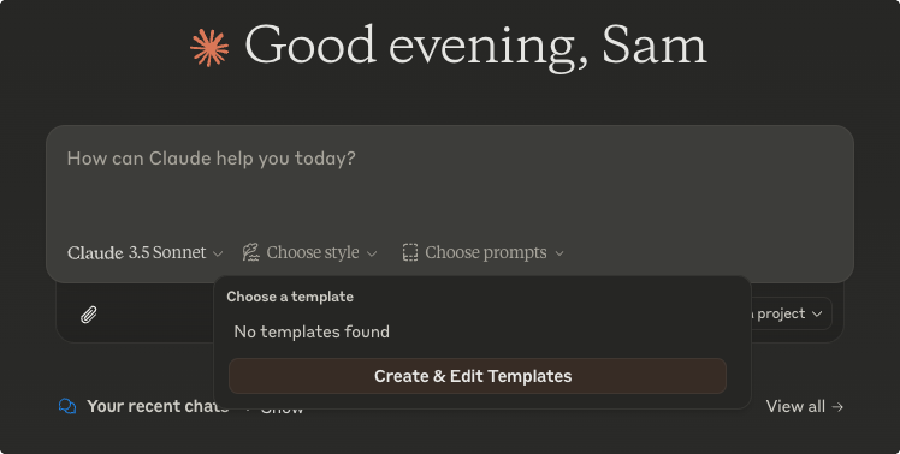

# LLM Interface Plus Documentation

Welcome to the LLM Interface Plus documentation! This Chrome extension enhances Claude with customizable prompt templates and improved controls.

## Table of Contents

- [Installation Guide](#installation-guide)
- [Features](#features)
- [Development Guide](#development-guide)
- [Technical Reference](#technical-reference)
- [Testing](#testing)
- [Troubleshooting & FAQ](#troubleshooting--faq)

## Installation Guide

### Prerequisites

- Google Chrome (version 121 or higher)
- Node.js and npm installed

### Building from Source

1. Clone the repository:
   ```bash
   git clone https://github.com/sotayamashita/llm-interface-plus
   ```
2. Install dependencies:
   ```bash
   npm install
   ```
3. Build the extension:
   ```bash
   npm run build
   ```
   This will create a `dist` folder containing the extension files.

### Loading the Extension

1. Open Chrome and navigate to `chrome://extensions`
2. Enable "Developer mode" in the top right
3. Click "Load unpacked" and select the `dist` folder

## Features

### Prompt Templates



Create and manage reusable prompt templates to streamline your interactions with Claude:

- Create custom templates with titles and content
- Edit existing templates
- Quick access from Claude's interface
- Templates sync across Chrome instances

### Modern UI Features

- **Dark Mode Support**: Automatically matches your system theme
- **Quick Access Controls**: Template button integrated into Claude's interface
- **Responsive Design**: Built with Shadcn UI and Tailwind CSS
- **Sync Storage**: Templates are synced across Chrome instances

## Development Guide

### Setup Requirements

- Node.js (LTS version recommended)
- npm (comes with Node.js)
- Chrome browser

### Development Commands

```bash
# Install dependencies
npm install

# Build extension
npm run build

# Watch for changes
npm run watch

# Run tests
npm run test

# Run E2E tests
npm run test:e2e
```

### Project Structure

```
src/
├── components/     # React components
├── lib/           # Utility functions
├── pages/         # Page components
├── templates/     # Default templates
├── content.tsx    # Content script
├── background.ts  # Service worker
├── manifest.json  # Extension config
└── options.tsx    # Options page
```

### Key Technologies

- TypeScript for type-safe code
- React for UI components
- Shadcn UI & Tailwind CSS for styling
- Parcel for bundling
- Playwright for E2E testing

## Technical Reference

### Core Components

- **OptionsPage**: Main component for managing templates
- **TemplateButton**: Dropdown for selecting templates
- **Content Script**: Injects template functionality
- **Background Service**: Handles extension events

### Configuration Files

- **manifest.json**: Extension configuration
- **package.json**: Project dependencies and scripts
- **tsconfig.json**: TypeScript configuration
- **tailwind.config.ts**: Styling configuration

## Testing

### Unit Testing

Run unit tests with:

```bash
npm run test
```

### E2E Testing

End-to-end tests use Playwright:

```bash
npm run test:e2e
```

### CI/CD Pipeline

- Automated testing on GitHub Actions
- Linting and type checking
- E2E tests with Playwright

## Troubleshooting & FAQ

### Common Issues

1. **Extension not loading**: Ensure you're using Chrome 121+
2. **Build errors**: Try removing node_modules and running npm install again
3. **Templates not syncing**: Check Chrome sync settings

### Getting Help

- Open an issue on GitHub
- Check existing issues for solutions
- Review the [Chrome Extension documentation](https://developer.chrome.com/docs/extensions/)

### Development Tips

- Use `npm run watch` for live reloading
- Check browser console for errors
- Test in incognito mode for clean environment
