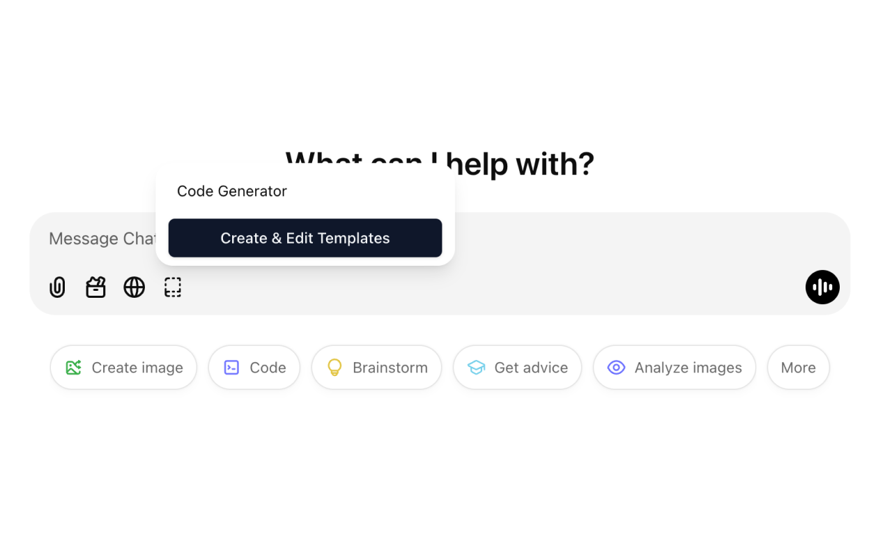
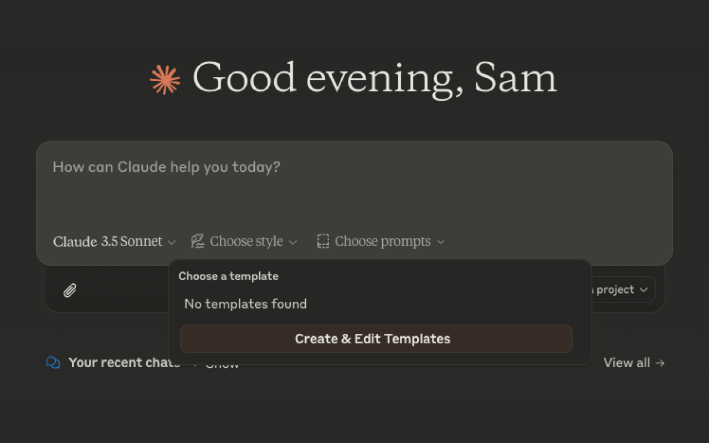
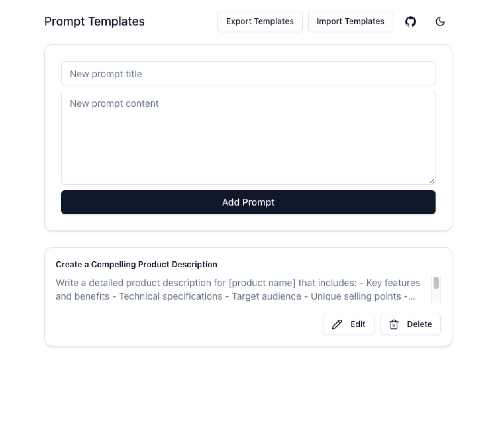
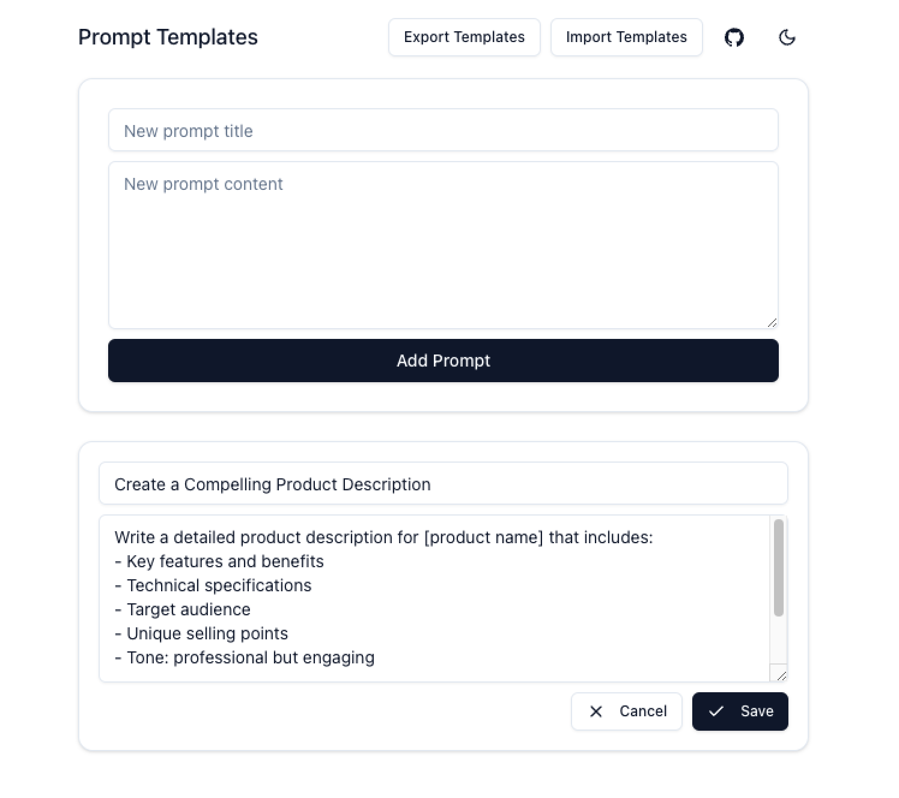

# LLM Interface Plus

[](https://github.com/sotayamashita/llm-interface-plus/actions/workflows/test.yml) [](https://app.fossa.com/projects/git%2Bgithub.com%2Fsotayamashita%2Fllm-interface-plus?ref=badge_shield&issueType=license) [](https://github.com/prettier/prettier) [](https://opensource.org/licenses/MIT) [](http://commitizen.github.io/cz-cli/)

> 🤖 Supported LLMs: [ChatGPT](https://chat.openai.com) · [Claude](https://claude.ai)

A Chrome extension that supercharges ChatGPT and Claude through customizable prompt templates and enhanced controls. Crafted with modern web technologies to deliver a seamless user experience.

## Install

[link-chrome-web-store]: https://chromewebstore.google.com/detail/llm-interface-plus/efdhlkgfdcpfolggaogaejbcmlojccma

[][link-chrome-web-store] [][link-chrome-web-store] and other Chromium browsers

## Preview

### Supported LLMs

<div align="center">
  <table>
    <tr>
      <td align="center"><b>ChatGPT Interface</b></td>
      <td align="center"><b>Claude Interface</b></td>
    </tr>
    <tr>
      <td></td>
      <td></td>
    </tr>
  </table>
</div>

### Prompt editing

<div align="center">
  <table>
    <tr>
      <td align="center"><b>New template</b></td>
      <td align="center"><b>Edit template</b></td>
    </tr>
    <tr>
      <td></td>
      <td></td>
    </tr>
  </table>
</div>

## Features

- 📝 **Prompt Templates**: Create, edit, and manage reusable prompt templates
- 🏷️ **Categories**: Organize templates with categories and filter by category
- 💾 **Template Backup**: Import and export templates for backup and sharing
- 🎨 **Modern UI**: Built with Shadcn UI and Tailwind CSS for a beautiful interface
- 🌓 **Dark Mode Support**: Automatic theme detection with manual override option
- ⚡ **Quick Access**: Easily access your templates from ChatGPT and Claude interfaces
- 🔄 **Sync Storage**: Templates are synced across your Chrome instances
- 🤖 **Multi-LLM Support**: Works with both ChatGPT and Claude

## Development

### Tech Stack

- TypeScript for type-safe code
- React for UI components
- Shadcn UI & Tailwind CSS for styling
- Parcel for bundling
- Chrome Extension Manifest V3
- Playwright for E2E testing

### Design

- [Design file is on Figma](https://www.figma.com/design/t2iic9fWyuqYDNKcPUUskk/llm-interface-plus?node-id=0-1&t=W51G1JKLVTEx98F8-1)

### 🛠 Build locally

```bash
# Checkout the copied repository to your local machine
git clone https://github.com/sotayamashita/llm-interface-plus
cd llm-interface-plus

# Install dependencies
npm install

# Build the extension
npm run build
```

The build step will create the `dist` folder, this folder will contain the generated extension.

### 🏃 Run the extension

Using [web-ext](https://extensionworkshop.com/documentation/develop/getting-started-with-web-ext/) is recommended for automatic reloading and running in a dedicated browser instance. Alternatively you can load the extension manually (see below).

```bash
# Watch for file changes and build continuously
npm run watch

# Install web-ext globally (only for the first time)
npm install --global web-ext

# Run the extension in a dedicated browser instance
web-ext run -t chromium

# Check that the extension is loaded by opening the extension options
```

#### Manually

You can also [load the extension manually in Chrome](https://www.smashingmagazine.com/2017/04/browser-extension-edge-chrome-firefox-opera-brave-vivaldi/#google-chrome-opera-vivaldi)

### 🧪 Test the extension

```bash
# Run tests
npm run test

# Run e2e tests
npm run test:e2e
```

### 📕 Read the documentation

Here are some websites you should refer to:

- [Parcel’s Web Extension transformer documentation](https://parceljs.org/recipes/web-extension/)
- [Chrome extensions’ API list](https://developer.chrome.com/docs/extensions/reference/)
- A lot more links in [fregante](https://github.com/fregante)'s [Awesome WebExtensions](https://github.com/fregante/Awesome-WebExtensions) list

## Contributing

Contributions are welcome! Please feel free to submit a Pull Request.
